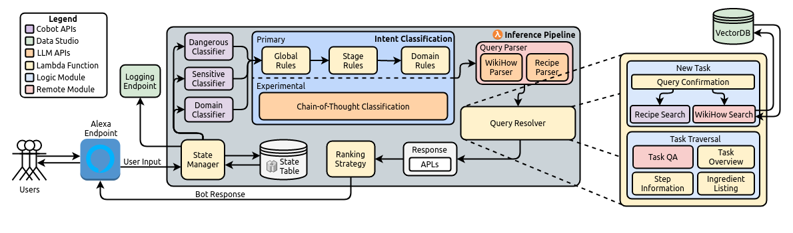

# BoilerBot: A Reliable Task-Oriented Chatbot Enhanced with Large Language Models
This is an official re-implementation of the task-oriented conversational chatbot Purdue's BoilerBot team developed for the Alexa Prize TaskBot Challenge 2.

## Architecture



## Setup

Ensure ports 8001-8003 & 27017 are unused. Then, from the root of the repository, run:
```bash
docker compose up
```
If you want to use cache from your host machine, you will have to change paths under volumes in `compose.yml` if `XDG_CACHE_HOME != /home/<user>` or if you are on Windows / OSX.

### Running

I'm working on developing a web frontend using [APL Viewhost](https://github.com/alexa/apl-viewhost-web) to render the APLs. In the meantime, the deployment is only available as an API. You can send POST requests to `http://localhost:8001/chat` with `query: str, uid: str|None, apl:true|false`, or visit `http://localhost:8001/docs` and press 'Try it out' for a friendlier UI.

The security key for requests to the GPU server is `insecure_placeholder`.

### UID

The UID enables conversation persistence. To start a new conversation, leave the field blank. To continue a conversation, use the UID returned from the previous request.

## Changes from the Original Deployment

Our TaskBot was developed using Amazon's Cobot (conversational bot) framework. The source for the framework, alongside Amazon's datasets and APIs are closed source and couldn't be a part of our public implementation. Therefore:
1. The Cobot framework was rewritten using an API base instead of the Lambda function that was originally used.
2. Task-relevant off-the-shelf models were taken from HuggingFace or manually developed to replace Amazon APIs.
3. Community datasets ([WikiHow-Dataset](https://github.com/mahnazkoupaee/WikiHow-Dataset/), [RecipeNLG](https://recipenlg.cs.put.poznan.pl/dataset)) were used as the task databases.
4. LLM modules are not functional. Will post an update as soon as I find the time and compute.

Owing to the less robust neural approaches, noisy datasets, and a framework re-implementation, some amount of reliability (e.g. intent classification) and efficiency (e.g. sequential NLU) of the system is lost. It is also why some design decisions are hacky hotfixes. If you run into a bug, please submit an issue.

# Citation
If you use our work, you can cite it using:
```bibtex
@inproceedings{boilerbot,
  title={BoilerBot: A Reliable Task-Oriented Chatbot Enhanced with Large Language Models},
  author={Hu, Yifei and Setpal, Jinen and Zhang, Damin and Zietek, Jacob and Lambert, Jack and Gonzalez, Rey Alex and Rayz, Julia},
  booktitle={2nd Proceedings of Alexa Prize TaskBot Challenge (Alexa Prize 2023)},
  year={2023},
  url = {https://www.amazon.science/alexa-prize/proceedings/boilerbot-a-reliable-task-oriented-chatbot-enhanced-with-large-language-models}
}
```
